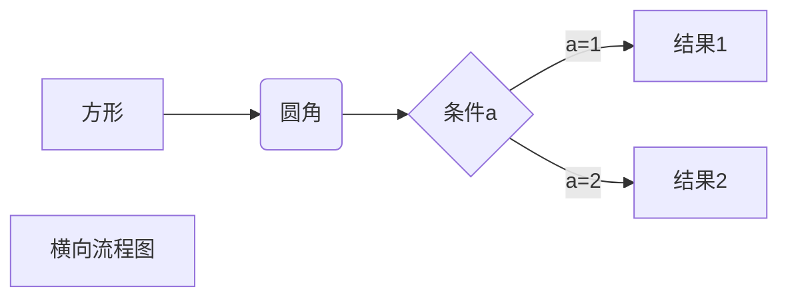
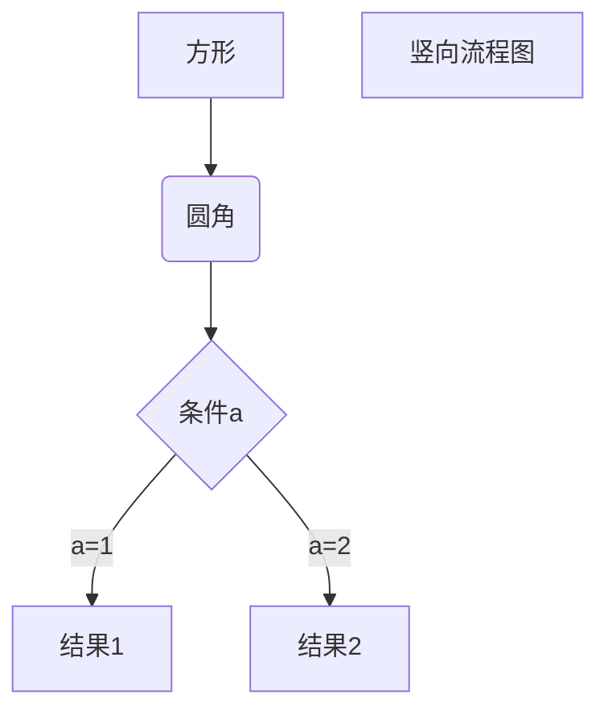
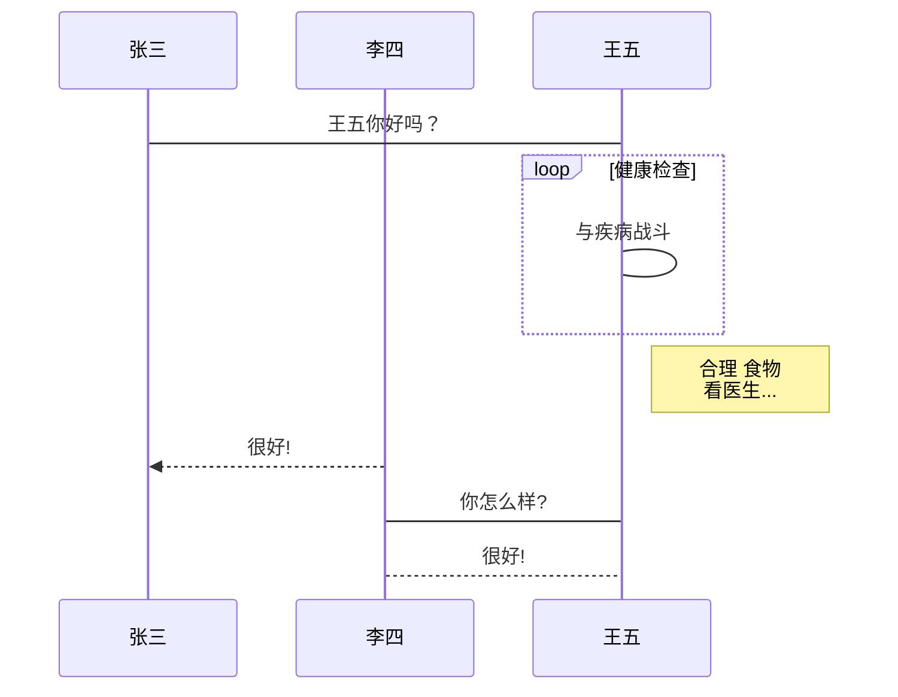
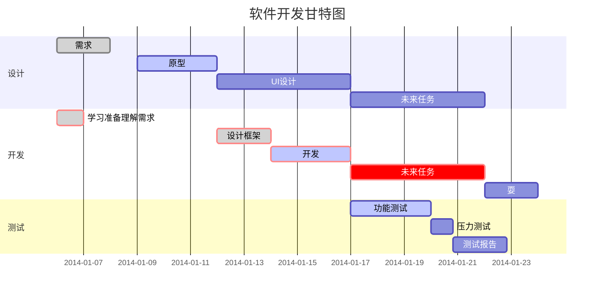

##  标题

Markdown支持6种级别的标题，对应html标签 `h1` ~ `h6`，严格的Markdown语法`＃`和文本之间要有一个空格。

```bash
# h1　这是一级标题
## h2　这是二级标题
### h3　这是三级标题
#### h4　这是四级标题
##### h5　这是五级标题
###### h6　这是六级标题
```

效果如下（实际演示会造成菜单混乱，所以此处使用截图）：


除此之外，Markdown还支持另外一种形式的标题展示形式，使用下划线进行文本大小的控制。但是这种形式仅有两种表现形式：即一级标题和二级标题。

```bash
这是一级标题
==========
这是二级标题
----------
```

效果如下：


-- -- --


##  分割线

使用三个或者三个以上的`-`或者`*`都可以。

```bash
---
----
***
*****
```

效果如下：

---

----

***

*****

可以看出效果都是一样的。

-- -- --


##  字体

* 粗体

  要加粗的文字左右分别用两个`*`号或下划线`_`包起来。

* 斜体

  要加斜的文字左右分别用一个`*`号或下划线`_`包起来。

* 斜粗体

  要加粗加斜的文字左右分别用三个`*`号或下划线`_`包起来。

* 删除线

  要加删除线的文字左右分别用两个波浪线`~~`包起来。

* 下划线

  要加下划线可以通过 HTML 的`<u>`标签来实现。

* 高亮

  文字高亮功能能使行内部分文字高亮，使用一对反引号。

```bash
**这是加粗的文字**
__这是加粗的文字__
*这是倾斜的文字*
_这是倾斜的文字_
***这是斜体加粗的文字***
___这是斜体加粗的文字___
~~这是加删除线的文字~~
<u>这是加下划线的文字</u>

这是要`高亮`的文字
```

效果如下：

**这是加粗的文字**
__这是加粗的文字__
*这是倾斜的文字*
_这是倾斜的文字_
***这是斜体加粗的文字***
___这是斜体加粗的文字___
~~这是加删除线的文字~~
<u>这是加下划线的文字</u>

这是要`高亮`的文字

-- -- --


##  引用

在引用的文字前加`>`即可，同样严格语法需要中间加一个空格。引用也可以嵌套，如加两个`>>`三个`>>>`n个...

```bash
>最外层嵌套
>>第一层嵌套
>>>>>>>>>>最内层嵌套
```

效果如下：

>最外层嵌套
>
>>第一层嵌套
>
>>>>>>>>>>最内层嵌套

-- -- --


##  列表

Markdown 支持有序列表和无序列表。无序列表使用星号`*`、加号`+`或是减号`-`作为列表标记：

```bash
* 第一项
* 第二项
* 第三项

+ 第一项
+ 第二项
+ 第三项

- 第一项
- 第二项
- 第三项
```

效果如下：

* 第一项
* 第二项
* 第三项

+ 第一项
+ 第二项
+ 第三项

- 第一项
- 第二项
- 第三项

有序列表使用数字并加上 `.` 号来表示，如：

```bash
1. 第一项
2. 第二项
3. 第三项
```

效果如下：

1. 第一项
2. 第二项
3. 第三项

列表可以嵌套使用，只需在子列表中的选项添加四个空格即可：

```bash
1. 第一项：
    - 第一项嵌套的第一个元素
    - 第一项嵌套的第二个元素
2. 第二项：
    - 第二项嵌套的第一个元素
    - 第二项嵌套的第二个元素
```

效果如下：

1. 第一项：
   - 第一项嵌套的第一个元素
   - 第一项嵌套的第二个元素
2. 第二项：
   - 第二项嵌套的第一个元素
   - 第二项嵌套的第二个元素

-- -- --


##  代码

如果是段落上的一个函数或片段的代码可以用反引号把它包起来，例如：

```bash
`print()`函数
```

效果如下：

`print()`函数

代码块需要使用４个空格或者一个制表符（Tab键）：

```bash
    fun (x: Int, y: Int): Int {
      return x + y
    }
```

​	效果如下

```kotlin
fun (x: Int, y: Int): Int {
  return x + y
}
```

或者使用'''code'''把代码包裹起来，也可以指定代码语言，这样可以进行代码高亮：

```
```javascript
$(document).ready(function () {
    alert('RUNOOB');
});
​```
```

效果如下：

```javascript
$(document).ready(function () {
    alert('RUNOOB');
});
```

-- -- --


##  链接

### 基本链接的使用方法

```
[链接名称](链接地址 "描述")　其中描述为鼠标放到url的显示文字，可加可不加。

或者

<链接地址>
```

```bash
这是一个链接 [hiyoung blog](https://hiyoungai.com　"我的博客")
```

效果如下：

这是一个链接 [hiyoung blog](https://hiyoungai.com "我的博客")

直接使用链接地址：

```
(https://hiyoungai.com)
```

效果如下：

<https://hiyoungai.com>

### 高级链接的使用方法

```
链接使用变量代替，文档末尾定义变量且带有链接地址。

这个链接使用１作为链接变量[Google][1]
这个链接使用url作为链接变量[baidu][url]

[1]:https://www.google.com
[url]:https://www.baidu.com
```

效果如下：

这个链接使用１作为链接变量[Google][1]
这个链接使用url作为链接变量[baidu][url]

[1]:https://www.google.com
[url]:https://www.baidu.com

### 锚点链接

每一个标题都是一个锚点，和HTML的锚点`#`类似：

```
[回到顶部](#Markdown基本语法)
```

效果如下：

[回到顶部](#Markdown基本语法)

-- -- --


##  图片

基本语法：

```


图片alt就是显示在图片下面的文字，相当于对图片内容的解释。
图片title是图片的标题，当鼠标移到图片上时显示的内容。title可加可不加

也可以使用高级链接的方式，此处不再演示。

例子：

```

效果如下：


-- -- --


##  表格

Markdown 制作表格使用 `|` 来分隔不同的单元格，使用 `-` 来分隔表头和其他行。

###  基本语法

```
|  表头   | 表头  |
|  ----  | ----  |
| 单元格  | 单元格 |
| 单元格  | 单元格 |
```

效果如下：

| 表头   | 表头   |
| ------ | ------ |
| 单元格 | 单元格 |
| 单元格 | 单元格 |

### 对齐方式

我们可以设置表格的对齐方式：

* `-:` 设置内容和标题栏居右对齐。
* `:-` 设置内容和标题栏居左对齐。
* `:-:` 设置内容和标题栏居中对齐。

效果如下：

```
| 左对齐 | 右对齐 | 居中对齐 |
| :-----| ----: | :----: |
| 单元格 | 单元格 | 单元格 |
| 单元格 | 单元格 | 单元格 |
```

效果如下：

| 左对齐 | 右对齐 | 居中对齐 |
| :----- | -----: | :------: |
| 单元格 | 单元格 |  单元格  |
| 单元格 | 单元格 |  单元格  |

而且表格中也可以混用其他语法：如粗体斜体，插入图片等。

-- -- --


##  高级技巧

###  支持html元素

不在 Markdown 涵盖范围之内的标签，都可以直接在文档里面用 HTML 撰写。目前支持的 HTML 元素有：` <kbd> <b> <i> <em> <sup> <sub> <br> `等 ，如：

```
使用 <kbd>Ctrl</kbd>+<kbd>Alt</kbd>+<kbd>Del</kbd> 重启电脑
```

效果如下：

使用 <kbd>Ctrl</kbd>+<kbd>Alt</kbd>+<kbd>Del</kbd> 重启电脑

###  转义字符

 Markdown 使用了很多特殊符号来表示特定的意义，如果需要显示特定的符号则需要使用转义字符，Markdow使用反斜杠转义特殊字符：

```
**文本加粗**
\*\* 正常显示星号 \*\*
```

 效果如下：

**文本加粗**
\*\* 正常显示星号 \*\*

 Markdown 支持以下这些符号前面加上反斜杠来帮助插入普通的符号：

```
\   反斜线
`   反引号
*   星号
_   下划线
{}  花括号
[]  方括号
()  小括号
#   井字号
+   加号
-   减号
.   英文句点
!   感叹号
```

###  数学公式

当你需要在编辑器中插入数学公式时，可以使用两个美元符 `$$` 包裹 `TeX` 或 `LaTeX` 格式的数学公式来实现。提交后，问答和文章页会根据需要加载 `Mathjax` 对数学公式进行渲染。如：

```
$$
\mathbf{V}_1 \times \mathbf{V}_2 =  \begin{vmatrix}
\mathbf{i} & \mathbf{j} & \mathbf{k} \\
\frac{\partial X}{\partial u} &  \frac{\partial Y}{\partial u} & 0 \\
\frac{\partial X}{\partial v} &  \frac{\partial Y}{\partial v} & 0 \\
\end{vmatrix}
$$
```

效果如下：
$$
\mathbf{V}_1 \times \mathbf{V}_2 =  \begin{vmatrix}
\mathbf{i} & \mathbf{j} & \mathbf{k} \\
\frac{\partial X}{\partial u} &  \frac{\partial Y}{\partial u} & 0 \\
\frac{\partial X}{\partial v} &  \frac{\partial Y}{\partial v} & 0 \\
\end{vmatrix}
$$

###  流程图

流程图需要平台支持，而我使用的hexo，需要安装如下三个插件：

```
npm install --save hexo-filter-flowchart
npm install --save hexo-filter-mermaid-diagrams
npm install --save hexo-filter-sequence
```

同时，对于`Matery`主题的博客还需要配置一下_config.xml和修改footer.ejs。

在主题的_config.yml中添加如下代码：

```
# Mermaid tag
mermaid:
  enable: true
  # Available themes: default | dark | forest | neutral
  theme: forest
  cdn: https://cdn.jsdelivr.net/npm/mermaid@8/dist/mermaid.min.js
  #cdn: //cdnjs.cloudflare.com/ajax/libs/mermaid/8.0.0/mermaid.min.js
```

在footer.ejs的结尾处添加：

```
<div class="progress-bar"></div>
<% if (theme.mermaid.enable) { %>
  <script src='<%= theme.mermaid.cdn %>'></script>
  <script>
    if (window.mermaid) {
      mermaid.initialize({theme: 'forest'});
    }
  </script>
<% } %>
```

如果不使用`mermaid`的话那么不需要上述配置。

####  横向流程图

```
```mermaid 
graph LR
A[方形] -->B(圆角)
    B --> C{条件a}
    C -->|a=1| D[结果1]
    C -->|a=2| E[结果2]
    F[横向流程图]
​```
```



####  纵向流程图

```
```mermaid
graph TD
A[方形] --> B(圆角)
    B --> C{条件a}
    C --> |a=1| D[结果1]
    C --> |a=2| E[结果2]
    F[竖向流程图]
​```
```



####  标准流程图

```
```flow
st=>start: 开始框
op=>operation: 处理框
cond=>condition: 判断框(是或否?)
sub1=>subroutine: 子流程
io=>inputoutput: 输入输出框
e=>end: 结束框
st->op->cond
cond(yes)->io->e
cond(no)->sub1(right)->op
​```
```

```flow
st=>start: 开始框
op=>operation: 处理框
cond=>condition: 判断框(是或否?)
sub1=>subroutine: 子流程
io=>inputoutput: 输入输出框
e=>end: 结束框
st->op->cond
cond(yes)->io->e
cond(no)->sub1(right)->op
```

#### 标准流程图（横向）

```
```flow
st=>start: 开始框
op=>operation: 处理框
cond=>condition: 判断框(是或否?)
sub1=>subroutine: 子流程
io=>inputoutput: 输入输出框
e=>end: 结束框
st(right)->op(right)->cond
cond(yes)->io(bottom)->e
cond(no)->sub1(right)->op
​```
```

```flow
st=>start: 开始框
op=>operation: 处理框
cond=>condition: 判断框(是或否?)
sub1=>subroutine: 子流程
io=>inputoutput: 输入输出框
e=>end: 结束框
st(right)->op(right)->cond
cond(yes)->io(bottom)->e
cond(no)->sub1(right)->op
```

####  UML时序图

```
```sequence
对象A->对象B: 对象B你好吗?（请求）
Note right of 对象B: 对象B的描述
Note left of 对象A: 对象A的描述(提示)
对象B-->对象A: 我很好(响应)
对象A->对象B: 你真的好吗？
​```
```

```sequence
对象A->对象B: 对象B你好吗?（请求）
Note right of 对象B: 对象B的描述
Note left of 对象A: 对象A的描述(提示)
对象B-->对象A: 我很好(响应)
对象A->对象B: 你真的好吗？
```

#### UML时序图（复杂样例）

```
```sequence
Title: 标题：复杂使用
对象A->对象B: 对象B你好吗?（请求）
Note right of 对象B: 对象B的描述
Note left of 对象A: 对象A的描述(提示)
对象B-->对象A: 我很好(响应)
对象B->小三: 你好吗
小三-->>对象A: 对象B找我了
对象A->对象B: 你真的好吗？
Note over 小三,对象B: 我们是朋友
participant C
Note right of C: 没人陪我玩
​```
```

```sequence
Title: 标题：复杂使用
对象A->对象B: 对象B你好吗?（请求）
Note right of 对象B: 对象B的描述
Note left of 对象A: 对象A的描述(提示)
对象B-->对象A: 我很好(响应)
对象B->小三: 你好吗
小三-->>对象A: 对象B找我了
对象A->对象B: 你真的好吗？
Note over 小三,对象B: 我们是朋友
participant C
Note right of C: 没人陪我玩
```

####  UML标准时序图

```
```mermaid
%% 时序图例子,-> 直线，-->虚线，->>实线箭头
  sequenceDiagram
    participant 张三
    participant 李四
    张三->王五: 王五你好吗？
    loop 健康检查
        王五->王五: 与疾病战斗
    end
    Note right of 王五: 合理 食物 <br/>看医生...
    李四-->>张三: 很好!
    王五->李四: 你怎么样?
    李四-->王五: 很好!
​```
```



####  甘特图

```
```mermaid
%% 语法示例
        gantt
        dateFormat  YYYY-MM-DD
        title 软件开发甘特图
        section 设计
        需求                      :done,    des1, 2014-01-06,2014-01-08
        原型                      :active,  des2, 2014-01-09, 3d
        UI设计                     :         des3, after des2, 5d
    未来任务                     :         des4, after des3, 5d
        section 开发
        学习准备理解需求                      :crit, done, 2014-01-06,24h
        设计框架                             :crit, done, after des2, 2d
        开发                                 :crit, active, 3d
        未来任务                              :crit, 5d
        耍                                   :2d
        section 测试
        功能测试                              :active, a1, after des3, 3d
        压力测试                               :after a1  , 20h
        测试报告                               : 48h
​```
```




###  Emoj表情

`Github`的`Markdown`语法支持添加emoji表情，输入不同的符号码（两个冒号包着的字符）可以显示出不同的表情（本网站没有添加该插件，需要支持Github的markdwon才可以正常显示）：

```
:bluesh:
```

效果如下：

😀

 具体每一个表情的符号码，可以查询`Github`的官方网页[http://www.emoji-cheat-sheet.com](http://www.emoji-cheat-sheet.com/)。 


###  插入视频

```
<video id="video" controls="" preload="none" poster="缩略图">
      <source id="视频url" type="video/mp4">
      </video>

例子：
<video id="video" controls="" preload="none" poster="">
      <source id="mp4" src="https://www.typora.io/img/beta.mp4">
      </video>
```

效果可在[Typora](#Typora)看到。


###  插入Github Star

```
  <iframe                         style="margin-left: 2px; margin-bottom:-5px;"                         frameborder="0" scrolling="0" width="100px" height="20px"                         src="https://ghbtns.com/github-btn.html?user=hiyoung123&repo=hiyoung123.github.io&type=star&count=true" >                     </iframe>
```

效果如下：

  <iframe                         style="margin-left: 2px; margin-bottom:-5px;"                         frameborder="0" scrolling="0" width="100px" height="20px"                         src="https://ghbtns.com/github-btn.html?user=hiyoung123&repo=hiyoung123.github.io&type=star&count=true" >                     </iframe>

-- -- --


##  工具介绍

###  Typora

特点：简洁，快速，可以实现所见即所得。看下面这个视频你就会知道他的`Simple, yet Powerful`

<video id="video" width="420" height="320" autoplay muted="muted" preload="preload" loop="loop" poster="https://cdn.jsdelivr.net/gh/hiyoung123/cdn/img/loading.gif">
      <source id="mp4" src="https://cdn.jsdelivr.net/gh/hiyoung123/CDN/video/video_markdown_typora.mp4" type="video/mp4">
      </video>


[Typora官方下载](https://www.typora.io/) 

###  Atom

特点：插件丰富（毕竟是Github推出的），并且可以用作其他语言的编辑器。其实也可以做到一边编辑一边看结果，只不过是需要多开一个窗口，😄！

[Atom下载地址](https://github.com/atom/atom)

###  总结

作者也是刚开始接触这两个软件，所以不是特别熟悉，等使用一段时间，对比之后再来详细的写一下。
流程图插件配置参考博客：https://blog.csdn.net/Olivia_Vang/article/details/92987859
